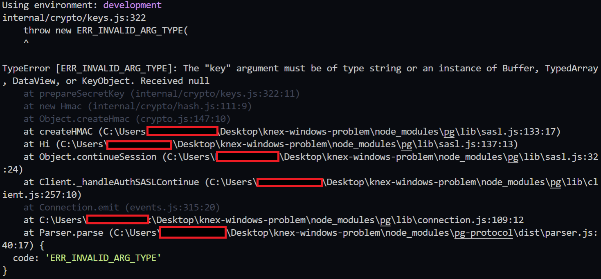

# knex-windows-problem

## Steps Taken

- `npm install pg knex` postgres and knex packages will be installed
- created a postgres database named **whats_on**
- `npx knex init` created ***knexfile.js***

***knexfile.js***

```js
// Update with your config settings.

module.exports = {

  development: {
    client: "pg",
    connection: "postgres://localhost/whats_on"
    }
};
```

- `npx knex migrate:make create_users_table` created migration file

***20201101235623_create_users_table.js***

```js
exports.up = function(knex) {
    return knex.schema.createTable("users", (table) => {
        table.increments();
        table.string("username")
        table.string("password")
        table.string("email")
    })
};

exports.down = function(knex) {
    return knex.schema.dropTable("users");
};
```

- `npx knex migrate:latest` with this command *TypeError [ERR_INVALID_ARG_TYPE]* is thrown



- current node version: v14.15.0
- current npm version: 6.14.8
- OS: Windows 10


